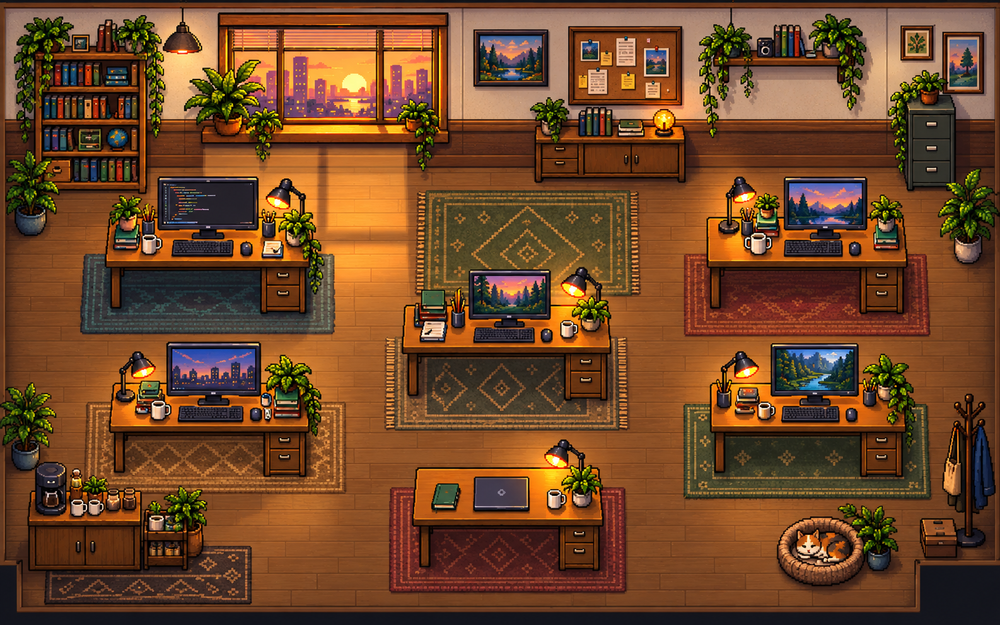

# PixAgent Factory

## Overview

PixAgent Factory is a visual command center for coordinating AI coding agents. It turns a collection of agent tasks into a pixel-art software studio where each coworker has a role, scoped capabilities, current assignment, progress, queue, and decision status.

The project combines an interactive pixel office with practical project controls so teams can understand what each agent is doing without losing track of blockers, evidence, approvals, or the next handoff. The goal is to make running coding agents feel like managing a small studio rather than juggling disconnected tabs.

## Problem Statement

Running several coding agents at once can become difficult to manage. Generic agents often overlap in responsibility, wait on unclear dependencies, and make it hard to see who owns the next decision. Developers need a simple way to inspect capacity, task ownership, progress, and blockers before work stalls.

## Solution

PixAgent Factory gives every coworker a distinct role, skills, tools, and task. The workspace makes the studio state visible through an interactive office, coworker roster, task scheduling, and agent detail panels. Users can edit a coworker's name and assignment, hire new coworkers, schedule work, inspect task status, and trigger a scoped agent run through a server-side API route.

## Studio Model

The factory is designed around bounded ownership. Each task has one accountable coworker, a limited set of tools, required evidence, and a clear next decision. This keeps parallel work visible and prevents generic agents from inventing dependencies between one another.

- Give each coworker a role-specific skill set and a scoped assignment.
- Run work in parallel while capacity and queue pressure remain visible.
- Place work in local or remote execution environments.
- Review blockers, evidence, and approval gates before work moves forward.
- Keep the game-like studio interface separate from the underlying execution runner.

## Features

- Pixel-art studio with distinct seated coworkers, clickable workstations, live local time, and subtle office movement
- Agent profiles with role, skills, tools, environment, capacity, task assignment, progress, and status
- Coworker task dossiers with work plans, blockers, evidence, next decisions, and scheduled follow-ups
- Editable coworker names and task assignments directly from the workspace
- Hiring flow for adding a coworker with a role and scoped capabilities
- Task board with current work, timed scheduling, manual completion, and task ownership
- Task scheduling that updates the office status when a scheduled task becomes due
- Project, task, activity, analytics, and agent management views
- Task contracts that show ownership, blocker, required evidence, and next decision
- Server-side factory API for tasks, agent ownership, decisions, blockers, and run history
- Optional server-side OpenAI task runner that keeps the API key out of the browser
- Cat interaction that supports petting, feeding, and a purring state
- Responsive pixel-themed landing page and workspace

## Tech Stack

- **Frontend:** Next.js 16, React 19, TypeScript, CSS
- **Backend:** Next.js Route Handlers
- **Database:** In-memory development store for the hackathon MVP
- **APIs / Services:** Optional OpenAI API integration for scoped agent runs
- **Hosting / Deployment:** Vercel
- **Other Tools:** Lucide React icons, GitHub, Git

## Codex / OpenAI Usage

Codex was used during the hackathon as a development partner for architecture planning, component implementation, styling, debugging, and build verification. It helped shape the interactive workspace, agent workflows, local scheduling behavior, responsive UI, and API integration.

The project also includes an optional OpenAI-powered server route for running a scoped task. The route accepts a worker's role, skills, tools, and assigned task, then returns a report for review. To enable it locally, add a valid `OPENAI_API_KEY` to `.env.local`. The key is never exposed to the client.

## Demo

### Live Demo

[Open PixAgent Factory](https://pixagentfactory.vercel.app/)

### Demo / Pitch Video

[Watch the demo and pitch video](https://drive.google.com/drive/folders/1r3SSdV47Z_0F9yJ4s7NRfIEUgbRaU_uX?usp=sharing)

Suggested demo flow:

1. Open the landing page and enter the agent workspace.
2. Show the live office clock and coworker roster.
3. Select a coworker and edit their name or assignment.
4. Schedule a task and show its status in the workspace.
5. Open the task view to explain ownership, blocker, evidence, and next decision.

## Screenshots



## How to Run Locally

```bash
git clone https://github.com/LyfSeeker/PixAgent-Factory.git
cd PixAgent-Factory
npm install
npm run dev
```

Open `http://localhost:3000` in a browser.

To enable the optional OpenAI task runner, create a `.env.local` file:

```bash
OPENAI_API_KEY=your_rotated_openai_api_key
```

Then use the demo action in the workspace to invoke the scoped task runner.

## API Routes

| Route | Purpose |
| --- | --- |
| `GET /api/factory` | Read agents and their task ownership |
| `POST /api/factory` | Create a scoped task assignment |
| `PATCH /api/factory/tasks/:id` | Update status, blocker, evidence, or decision |
| `POST /api/agents/run` | Run a scoped task and save a report for review |

## Additional Notes

This is a hackathon MVP. Agent and scheduling state are currently stored in memory, so they reset when the server restarts. The next production steps are persistent storage, authentication, real-time collaboration, and a more complete coding-agent execution runner.

The current integration is an optional OpenAI server-side task runner. Connecting existing Codex or Claude accounts, attaching real terminal sessions, and persisting session history are planned product integrations, not claims of the current MVP.

The pixel office artwork and worker sprites are original assets created for this project. The product takes inspiration from the general idea of a game-like agent workspace, without reusing external product branding, characters, or source artwork.
